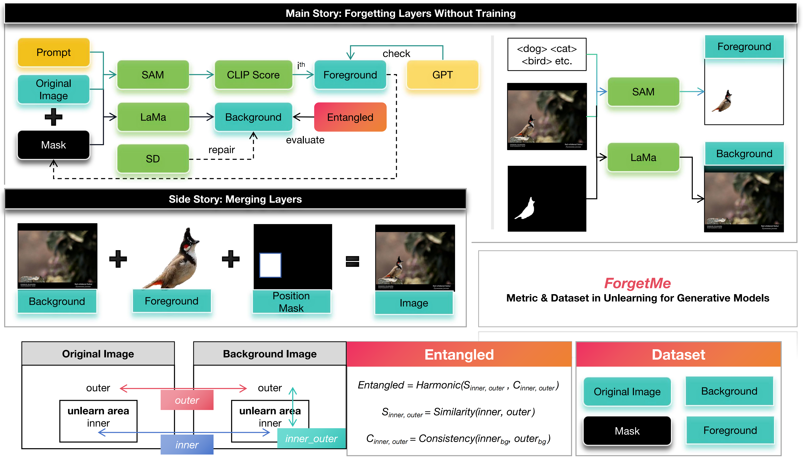

# ForgetMe: Benchmarking the Selective Forgetting Capabilities of Generative Models

<p align="center">  </p>

## 🚀 Getting Started

### Installation

```bash
git clone https://github.com/YuZhenyuLindy/ForgetMe.git
cd ForgetMe
pip install -r requirements.txt
```

### Usage

#### 1. Dataset Creation

```bash
python scripts/create_dataset.py --dataset bird --out_dir ./data/forgetme_bird
```

#### 2. Unlearning with LoRA

```bash
python scripts/train_lora.py --prompt "<cat>" --dataset ./data/forgetme_cat
```

#### 3. Evaluation with Entangled

```bash
python scripts/evaluate.py --method ours --dataset ./data/forgetme_dog
```

---

## 📜 Citation

If you find this work useful, please cite our paper:

```bibtex
@article{yu2025forgetme,
  title={ForgetMe: Benchmarking the Selective Forgetting Capabilities of Generative Models},
  author={Yu, Zhenyu and Idris, Mohd Yamani Inda and Wang, Pei and Xia, Yuelong and Xiang, Yong},
  journal={EAAI},
  year={2025}
}
```
